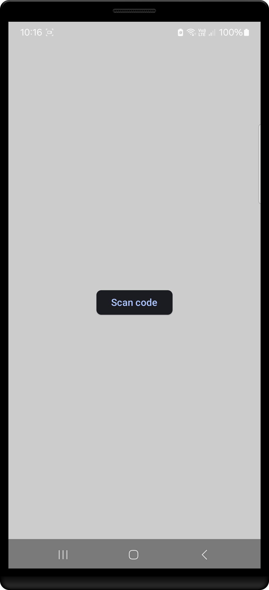
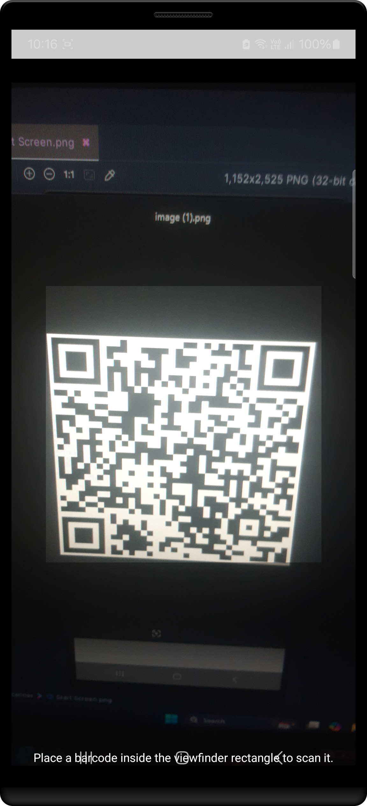
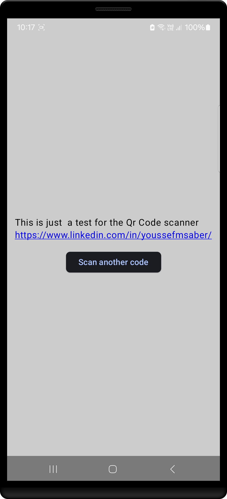

# Code Scanner

A simple Android application that scans QR codes and returns the scanned value. This project uses the ZXing library for QR code scanning and Jetpack Compose for the UI.

## Features
- Scan QR codes using the device camera.
- Display the value of the scanned QR code.

## Requirements
- Android Studio
- Kotlin 1.8 or higher
- Jetpack Compose
- Android 5.0 (API level 21) or higher

## Dependencies
- [ZXing Android Embedded](https://github.com/journeyapps/zxing-android-embedded) - A powerful library for scanning QR codes on Android.
- [ZXing Core](https://github.com/zxing/zxing) - The core ZXing library for QR code scanning.

The following dependencies are included in the project:

```gradle
implementation "com.journeyapps:zxing-android-embedded:4.3.0"
implementation "com.google.zxing:core:3.4.1"
```

## Setup

1. **Clone the repository**:
   ```bash
   git clone https://github.com/yourusername/code-scanner.git
   ```

2. **Open the project in Android Studio**.

3. **Build the project** to download necessary dependencies.

4. **Run the app** on a physical device or emulator.

## Implementation Details

- **ZXing for QR Scanning**:
  The app uses the ZXing library to scan QR codes. The library integrates with the camera to detect and decode QR codes.

- **Jetpack Compose UI**:
  The UI is built using Jetpack Compose, the modern Android UI toolkit. It provides a declarative approach to building UIs with less boilerplate code.

## Usage

Once the app is launched, follow these steps:

1. **Grant Camera Permission**:
   When you run the app for the first time, you will be prompted to grant camera permissions.

2. **Scan a QR Code**:
   Point the camera towards a QR code. The app will automatically detect and scan it.

3. **View the Result**:
   The value of the scanned QR code will be displayed on the screen.

## Permissions

Make sure to include the following permissions in your `AndroidManifest.xml` to allow the app to access the device's camera:

```xml
<uses-permission android:name="android.permission.CAMERA" />
<uses-feature android:name="android.hardware.camera" />
<uses-feature android:name="android.hardware.camera.autofocus" />
```


| Start Screen                                                    | Taking picture                                                    | Output                                                       |
|-----------------------------------------------------------------|-------------------------------------------------------------------|--------------------------------------------------------------------|
|  |  |  |

---

## Troubleshooting

- **Camera not working**: Ensure that the app has the necessary camera permissions, and try restarting the app.
- **QR Code not detected**: Ensure that the QR code is clearly visible and within the camera's focus range.

## License

This project is licensed under the MIT License - see the [LICENSE](LICENSE) file for details.

---

This README provides a clear overview of the project, how to set it up, and basic usage. You can further customize or expand the documentation depending on the additional features and specifics of your app.
